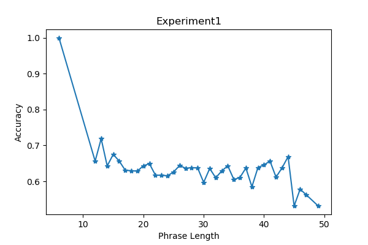

# CS5304: Assignment 4
Author: **Lixuan Mao (lm769)**

<!-- ## 0. Train Dataset Preprocess
In the train dataset, I find that phrases of `label 2(neutral)` take more than 60% of the whole train dataset, which may make the model hugely biased and predict every phrase as `label 2(neutral)`.

So in order to eliminate such bias, I only used half of the label 2 phrases of the train dataset(randomly picked) while training models in the six experiments. -->
## 1. Sample Commands
- Exp 1:
```
python assign4.py --data /path/to/stanfordSentimentTreebank \
--embeddings /path/to/GoogleNews-vectors-negative300.txt \
--model model_exp1.ckpt --static
```
- Exp 2:
```
python assign4.py --data /path/to/stanfordSentimentTreebank \
--embeddings /path/to/glove.840B.300d.txt \
--model model_exp2.ckpt --static
```
- Exp 3:
```
python assign4.py --data /path/to/stanfordSentimentTreebank \
--embeddings /path/to/GoogleNews-vectors-negative300.txt \
--embeddings2 /path/to/glove.840B.300d.txt \
--model model_exp3.ckpt --static --two_channel
```
- Exp 4:
```
python assign4.py --data /path/to/stanfordSentimentTreebank \
--embeddings /path/to/GoogleNews-vectors-negative300.txt \
--model model_exp4.ckpt
```
- Exp 5:
```
python assign4.py --data /path/to/stanfordSentimentTreebank \
--embeddings /path/to/glove.840B.300d.txt \
--model model_exp5.ckpt
```
- Exp 6:
```
python assign4.py --data /path/to/stanfordSentimentTreebank \
--embeddings /path/to/GoogleNews-vectors-negative300.txt \
--embeddings2 /path/to/glove.840B.300d.txt \
--model model_exp6.ckpt --two_channel
```
If you want to run test on the models of these experiments, the first thing you need to do is add `--eval_only_mode` behind corresponding commands and the second thing is to add `--predictions /path/to/${your_predictions_name}.txt` behind corresponding commands.

## 2. Results Demonstration & Analysis
### 2.0 Common Settings
`batch_size=32, max_steps=3000, eval_every=1000` are used in these experiments.

`Negative Log Likelihood Loss(NLLoss)` is used to train the models.

Use such optimizer:
`optim.Adam(lr=3e-4, weight_decay=0.01)`

### 2.1 General Accuracy


First, I will demonstrate and compare the best validation accuracy in six experiments.
The results are as follows:
|Experiment No.   | Best Validation Accuracy  | Loss|
|---|---| --- |
| 1  | 0.6299450993056677 | 0.5931962728500366|
| 2  | 0.633497497174229  |1.0328450202941895 |
| 3  | 0.6360406911028581 |0.9170072078704834 |
| 4  | 0.5694735992249313  |1.186639428138733 |
| 5  | 0.6003148716292589  |0.8878021240234375 |
| 6  | 0.5997497174228968  | 1.0014173984527588 |

One interesting thing one can observe from the data is that models that use `GloVe` to train(partially or solely) achieve higher accuracies thant the models that only use `GoogleNews word2vec` to train.

And it can be seen that if enabling fine-tune in the embeddings, one can get some decrease in the accuracy.

### 2.2 Label Accuracy
During these experiments, I also calculated the validation accuracies for each label. In the six experiments, the label accuracies are shown as follows:
| Accuracy  | label 0| label 1| label 2| label 3  | label 4  |
|---|---|---|---|---|---|
| Exp.1  | 0.0  |  0.33942 |0.88375 | 0.48795  |  0.0 |
| Exp.2  | 0.02988  | 0.39575  | 0.86446  | 0.49448  | 0.03812  |
| Exp.3  | 0.01792  | 0.39819  | 0.87785|  0.47387  | 0.02877 |
| Exp.4  | 0.0   | 0.10265  | 0.95589  |0.18346| 0.0  |
| Exp.5  | 0.0   | 0.23091  | 0.93384  |0.29204  |0.00071942    |
| Exp.6  | 0.0   | 0.21189  | 0.93593  | 0.29938 | 0.00071942  |

From the results of the experiments, one can see that accuracies are highest in `label 2(neutral)` and the second highest accuracies are seed in `label 3(positive)`.

From the data, one can see that models using `GloVe`(partially or solely) perform better than models using `Google News word2vec` solely in terms of `label 1(negative)` accuracy.

Another observation is that models that use fine-tune perform better than models that don't use fine-tune on `label 2(neutral)`.

And the accuracies in `label 0(very negative)` and `label 4(very positive)` drop to very low, which means that it is nearly impossible to tell if a phrase is very negative or very positive using the classifier with current architecture.
I think the reason why this situation happened is that on the one hand, there are too few phrases with `label 0` and `label 4` in the train dataset, which gives few chances for the models to learn the patterns behind them. On the other hand, phrases with `label 0(very negative)` and `label 1(negative)`(as well as `label 4(very positive)` and `label 3(positive)`) share so many common features, which makes it not easy to tell if a phrase is negative or very negative (I think even human may have hard time differentiating between them).

### 2.3 Phrase Length Accuracy
During these experiments, I calculated the validation accuracies for different phrase length. In the six experiments, the accuracies in different phrase length are illustrated as follows:



From the charts above, although different models may have slight differences, one can see that the accuracies of shorter phrases tend to be higher than the accuracies of longer phrases.

When phrase length exceeds certain threshold, the accuracy drops drastically.
## 3. Citations
https://github.com/DSKSD/DeepNLP-models-Pytorch
