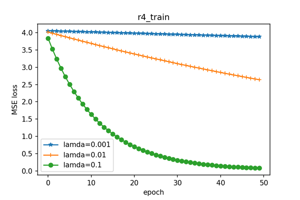

# CS5304: Assign5
**Lixuan Mao (lm769)**
## Task 1
In this task, I use `r1~r5.train` to train Matrix Factorization (without bias term) models and use the corresponding test set to validate them. The number of latent features of these models is `4`.

The following chart shows how the MSE losses change over the epochs in the training process with `r1~r5.train`.

One can see that when regularization parameters `λ` increases, the MSE loss decreases more rapidly over the epochs.

The following table shows the MSE losses of the models over their corresponding test set.

|  | r1.train  | r2.train  | r3.train  | r4.train  |  r5.train | Standard Error |
|---|---|---|---|---|---|---|
| λ=0.001  | 3.832  | 3.803  |  3.800 |  3.857 | 3.123  | 0.1403|
| λ=0.01  | 2.623  |  2.611 | 2.608  |  2.611 |  2.257 | 0.07129|
| λ=0.1  |  0.08087 |  0.06737 | 0.06279  |  0.06046 | 0.1038  | 0.008008 |

From the statistical data above, we can see that `λ=0.1` is the best regularization parameter to use for the Matrix Factorization model (without bias term).

## Task 2
For this task, I train the Matrix Factorization (with bias term) models only for movie bias but not for user bias. The number of latent features of these models is `4`.

The following chart shows how the MSE losses change over the epochs in the training process with `r1~r5.train`.

One can see that for the Matrix Factorization model with bias term, when regularization parameters `λ` increases, the MSE loss also decreases more rapidly over the epochs.

The following table shows the MSE losses of the models over their corresponding test set.

|  | r1.train  | r2.train  | r3.train  | r4.train  |  r5.train | Standard Error |
|---|---|---|---|---|---|---|
| λ=0.001  | 4.820  | 4.813 |  4.804 |  4.820 | 4.117  | 0.1394|
| λ=0.01  | 3.420  |  3.407 | 3.414  |  3.424 |  3.343| 0.01492|
| λ=0.1  |  0.1945 |  0.1827 | 0.1786  |  0.1761 | 0.2914  | 0.02191|

From the statistical data above, we can see that `λ=0.1` is the also best regularization parameter to use for the Matrix Factorization model (with bias term).
