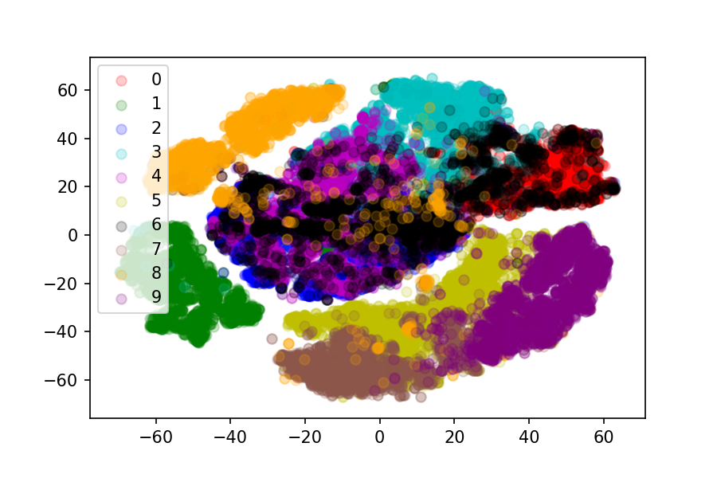

# CS5304: Assignment 6
**Lixuan Mao (lm769)**
## Dimensionality Reduction Results
### 1. PCA projection

### 2. ISOMAP

### 3. t-SNE on the raw image

### 4. t-SNE on features extracted

## Analysis
### 1. How is a linear projection (PCA) different than the non-linear projection (ISOMAP)?

From the results, one can see that ISOMAP produces better separation of images of different categories. But ISOMAP needs more time and memory to do the dimensionality reduction.

Linear projection (PCA) uses linear functions to project high-dimensional vectors to low-dimensional ones. So from the result of question 1, one can see that images of same category have some linear relationship (tends to form a line). Mathematically The principle components of PCA are an orthogonal basis sorted by amount of variance along the particular dimension. This makes the direction of the principle component vectors tell a story about your original data: which variables account for the most or least variation. And this is something non-linear projection (ISOMAP) cannot deliver.

However, the non-linear projection (ISOMAP) uses non-linear functions to do the dimensionality reduction. Therefore, images of same category do not have certain kind of linear relationship, and because ISOMAP is non-linear, it can be more likely to capture the structure of trickier manifolds. From the result graph, one can see that images of same category are more likely to form a cluster instead of forming a line.

### 2. How does t-SNE differ from PCA?

From the results above, generally, t-SNE does a much better job of separating images of different categories than PCA does.

From the graphs, one can see that t-SNE tries to deconvolute relationships between neighbors in high-dimensional data and is a non-linear projection, two of which are very different from PCA.

Besides, t-SNE doesn't have the characteristics of PCA stated in question 1, which is also a big difference.

### 3. How does dimensionality reduction on the raw data compare to the same process on the extracted features?

From the two result graphs, one can see that dimensionality reduction on the raw data has more overlapping among different categories than dimensionality reduction on the extracted features.

The features extracted can reflect the underline characteristics of images, so doing dimensionality reduction on them may be more likely to capture the structure of more sophisticated manifolds, which leads to less overlapping than the other.
